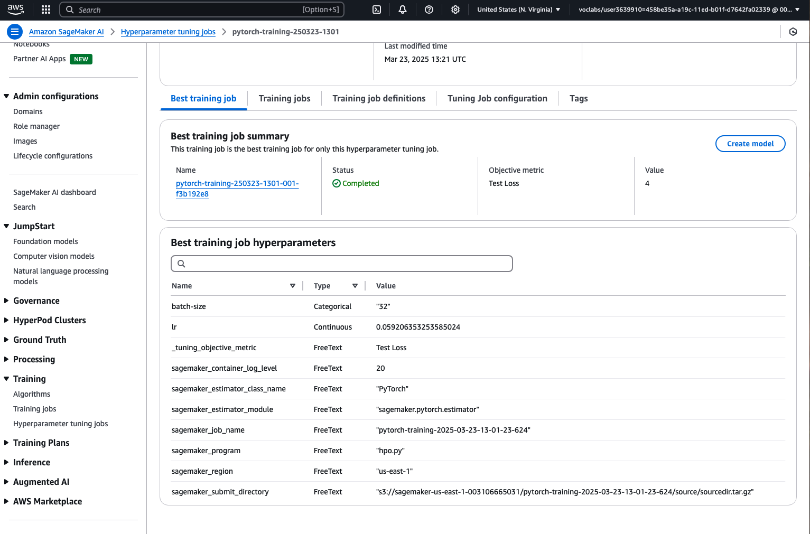

# Image Classification using AWS SageMaker

Use AWS Sagemaker to train a pretrained model that can perform image classification by using the Sagemaker profiling, debugger, hyperparameter tuning and other good ML engineering practices.

Selected dataset: dog breed classication avaiable [here](https://s3-us-west-1.amazonaws.com/udacity-aind/dog-project/dogImages.zip)

Project file Notebook: [`train_and_deploy.ipynb`](train_and_deploy.ipynb), which contains output.

## Project Set Up and Installation
Enter AWS through the gateway in the course and open SageMaker Studio. 
Download the starter files.
Download/Make the dataset available. 

## Dataset
The provided dataset is the dogbreed classification dataset which can be found [here](https://s3-us-west-1.amazonaws.com/udacity-aind/dog-project/dogImages.zip).

### Access
Upload the data to an S3 bucket through the AWS Gateway so that SageMaker has access to the data. 

## Hyperparameter Tuning
The pretrained ResNet50 model, as it is well-suited and used for image classification tasks. Hyperparameter tuning was conducted using the script [`hpo.py`](hpo.py). To speed up the tuning process, only 10% of the dataset images were used.

Two hyperparameters were chosen for optimization:
- **Learning rate**: This was tuned to determine the rate at which the model learns while avoiding overfitting.
- **Batch size**: The goal was to find the optimal batch size that would improve training efficiency.

Hyperparameter tuning ranges:
- The learning rate was adjusted within the range of `0.001` to `0.1`, with the optimal value found at `0.059206353253585024`.
- The batch size was tested with values `{32, 64, 128, 256, 512}`, with the optimal value determined to be `32`.

Results of the hyperparameter tuning jobs:

## Debugging and Profiling
To debug the final model, I created an additional script: [`train_model.py`](train_model.py).

The model uses the optimal hyperparameters found in the previous step:
- **Learning rate**: `0.059206353253585024`
- **Batch size**: `32`

In the Jupyter notebook, various rules for the debugger and profiler were configured. Additionally, the training now utilizes 20% of the dataset images. Ideally, the training would use the full dataset, but this would make the job take an impractically long time.

### Results
Profiler results are located in HTML file [here](ProfilerReport/profiler-report.html).
Profiler notebook are located in file [here](ProfilerReport/profiler-report.ipynb).
Profiler files are located in [here](ProfilerReport/profiler-reports).

The plot shows the learning parameters over time as presented in figure below:

## Model Deployment
To deploy the model, we need to create an additional entry point for loading and preprocessing the image. These operations are handled in the `inference.py` file (not in `train_model.py`!).

An example of the preprocessing procedure can be found in the notebook [`train_and_deploy.ipynb`](train_and_deploy.ipynb). 

The trained model produces the correct results for the test image.

A screenshot of the deployed active endpoint in Sagemaker.

